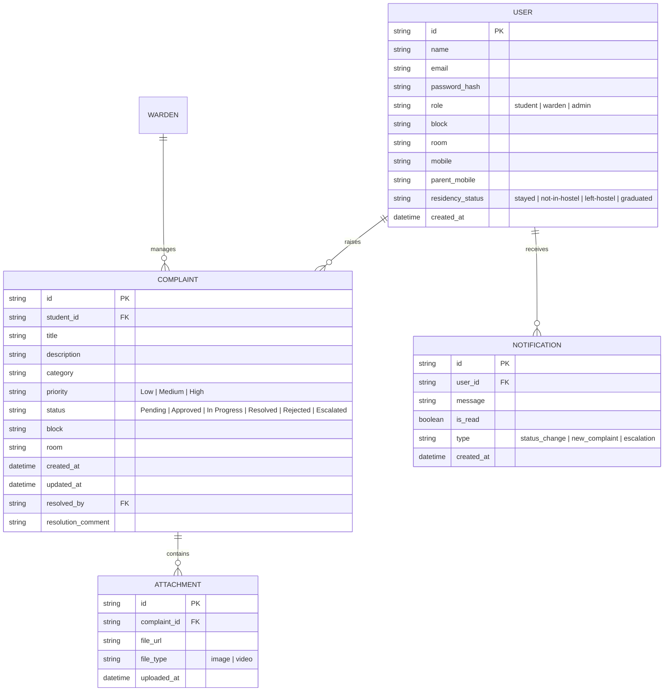

# Database Architecture & ER Diagram

This document outlines the database schema and entity relationships for the Hostel Complaint Raising Platform.

## 📊 Entity Relationship (ER) Diagram

---

## 📑 Table Schemas

### 1. `users` Table
Stores authentication and profile information for students, wardens, and administrators.

| Column | Type | Constraints | Description |
| :--- | :--- | :--- | :--- |
| `id` | UUID | PK, Not Null | Unique identifier for the user. |
| `name` | VARCHAR(255) | Not Null | Full name of the user. |
| `email` | VARCHAR(255) | Unique, Not Null | Email used for login. |
| `password_hash` | VARCHAR(255) | Not Null | Hashed password. |
| `role` | ENUM | Not Null | Role: `student`, `warden`, or `admin`. |
| `block` | VARCHAR(10) | | Hostel block (e.g., 'A', 'B'). |
| `room` | VARCHAR(10) | | Room number assignemnt. |
| `mobile` | VARCHAR(15) | | Personal contact number. |
| `parent_mobile` | VARCHAR(15) | | Parent/Guardian contact number. |
| `residency_status` | ENUM | Default 'stayed' | `stayed`, `not-in-hostel`, `left-hostel`, `graduated`. |

### 2. `complaints` Table
Tracks the lifecycle of a complaint from submission to resolution.

| Column | Type | Constraints | Description |
| :--- | :--- | :--- | :--- |
| `id` | VARCHAR(20) | PK, Not Null | Prefixed ID (e.g., C-1001). |
| `student_id` | UUID | FK (users.id) | ID of the student who raised it. |
| `title` | VARCHAR(255) | Not Null | Short summary of the issue. |
| `description` | TEXT | Not Null | Detailed explanation. |
| `category` | VARCHAR(50) | Not Null | e.g., 'Electrical', 'Plumbing'. |
| `priority` | ENUM | Default 'Medium' | `Low`, `Medium`, `High`. |
| `status` | ENUM | Default 'Pending' | Current state of processing. |
| `block` | VARCHAR(10) | Not Null | Location block. |
| `room` | VARCHAR(10) | Not Null | Location room. |
| `created_at` | TIMESTAMP | Default NOW() | Submission timestamp. |
| `resolved_by` | UUID | FK (users.id) | Warden/Admin who closed the issue. |
| `resolution_comment` | TEXT | | Final notes upon resolution. |

### 3. `attachments` Table
Stores references to media files uploaded with complaints.

| Column | Type | Constraints | Description |
| :--- | :--- | :--- | :--- |
| `id` | UUID | PK | Unique attachment ID. |
| `complaint_id` | VARCHAR(20) | FK (complaints.id) | Parent complaint. |
| `file_url` | TEXT | Not Null | Storage bucket URL or local path. |
| `file_type` | VARCHAR(20) | | 'image' or 'video'. |

### 4. `notifications` Table
In-app alerts for status updates and assignments.

| Column | Type | Constraints | Description |
| :--- | :--- | :--- | :--- |
| `id` | UUID | PK | Unique notification ID. |
| `user_id` | UUID | FK (users.id) | Recipient of the alert. |
| `message` | TEXT | Not Null | Notification content. |
| `is_read` | BOOLEAN | Default FALSE | Read tracking. |
| `type` | VARCHAR(50) | | Logic categories for UI icons. |
